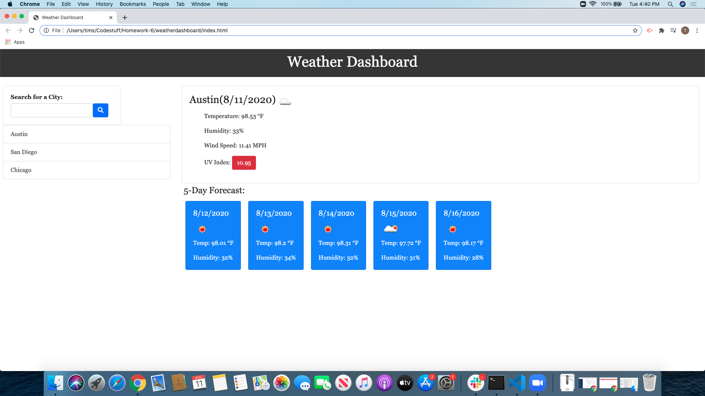

# Weather Dashboard #

[Github Pages Link](https://tbsanders5.github.io/weatherdashboard/)

## Description ##
A simple weather search by entering the city you wish to view. The application dissplays a 5 day forecast underneath the current days forecast. Recent searches are saves in local storage, appear underneath and can be clicked to return to those searches.

## Resources ##

* [Nancy Lambert-Brown](https://github.com/n-lambert)
* [Plover Brown](https://github.com/rebgrasshopper)
* [Zachary Bryan](https://github.com/zacharybryan)
* [Nicholas Konzen](https://github.com/NTKonzen)
* [Talia Vazquez](https://github.com/taliavazquez)
* Bootstrap
* Font Awesome
* jQuery
* AJAX

## Usage ##

1. Enter the city you wish to view in the search bar.
1. Press enter or click the search icon to find the weather on that city.
1. See your current day display in the large box.
1. See the 5 day forecast underneath.
1. Click on a recent search to bring that forecast back up.
1. Can be cleared in your local storage to remove old searches.

## License ##

GNU General Public License

---

Copyright (c) 2020 Sanders, Timothy

Permission is hereby granted, free of charge, to any person obtaining a copy
of this software and associated documentation files (the "Software"), to deal
in the Software without restriction, including without limitation the rights
to use, copy, modify, merge, publish, distribute, sublicense, and/or sell
copies of the Software, and to permit persons to whom the Software is
furnished to do so, subject to the following conditions:

The above copyright notice and this permission notice shall be included in all
copies or substantial portions of the Software.

THE SOFTWARE IS PROVIDED "AS IS", WITHOUT WARRANTY OF ANY KIND, EXPRESS OR
IMPLIED, INCLUDING BUT NOT LIMITED TO THE WARRANTIES OF MERCHANTABILITY,
FITNESS FOR A PARTICULAR PURPOSE AND NONINFRINGEMENT. IN NO EVENT SHALL THE
AUTHORS OR COPYRIGHT HOLDERS BE LIABLE FOR ANY CLAIM, DAMAGES OR OTHER
LIABILITY, WHETHER IN AN ACTION OF CONTRACT, TORT OR OTHERWISE, ARISING FROM,
OUT OF OR IN CONNECTION WITH THE SOFTWARE OR THE USE OR OTHER DEALINGS IN THE
SOFTWARE.
